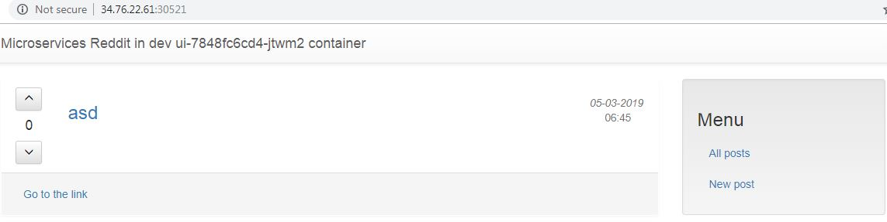

# AleksZimin_microservices
AleksZimin microservices repository

## HW-23
[](https://travis-ci.com/Otus-DevOps-2018-09/AleksZimin_microservices)

### Основное задание:
* Проверил работу kube-dns. Отключил kube-dns-autoscaler. Отключил kube-dns. Связь между контейнерами пропала.
* Сделал ui-service типа NodePort, который прослушивает заданный порт на всех нодах из интернета и перенаправляет их на поды, подходящие к заданным условиям (перенаправление будет осуществляться даже если подов на данной ноде нет)
* Сделал ui-service типа LoadBalancer: единая точка входа. Перенаправляет трафик из интернета на NodePort, который может быть настроен на прослушивание трафика только внутри сети кластера
* Сделал ingress для ui. Для работы ingress нужен сервис с типом NodePort. Настроил ingress на работу с http.
* Создал tls-сертификат с ключом и на его основе создал секрет в kubernetes. Убрал в ingress возможность работы по http.
* Включил сетевой плагин Calico, чтобы включить NetworkPolicy.
* Запретил обращаться к монге со всех подов, кроме comment. 
* Проверил работу монги с volume emptyDir. Данные удаляются после пересоздания пода.
* Поменял volume emptyDir на предварительно созданый persistent диск в GCP.
* Проверил работу монги с persistent диском. Данные сохраняются после пересоздания пода.
* Создал описание для persistent volume из уже созданного диска.
* Создал описание для persistentVolumeClaim и применил этот claim к уже созданному деплойменту.
* Подключил динамический PVC к подам монги

## HW-22
[](https://travis-ci.com/Otus-DevOps-2018-09/AleksZimin_microservices)

### Основное задание:
* Установил kubectl и minikube на Linux на отдельной виртуалке, запущенной в KVM (использовалась вложенная виртуализация). Приложение проверял с помощью ssh туннелей
* Создал deployments и services.
* Добавил два алиаса-сервиса для mongodb, чтобы микросервисы post и comment могли подключиться БД. Так же добавил переменные окружения в микросервисы, которые указывают новый адрес БД (имена алиасов-сервисов не могут создержать нижнее подчёркивание).
* Посмотрел дашборд, немного поковырялись.
* Создал dev namespace. Запустил приложение в нём.
* Добавил переменную окружения в UI. В коде приложения эта переменная выводится в шапке главной страницы.
* Развернул кластер в GKE, перенес туда приложение и создал правила фаервола.
* Ссылка на приложение http://34.76.22.61:30521 


* Включил дашбоард в GKE, подключился к нему через kubectl-proxy. Адрес дашбоарда (порт другой из за ssh туннеля):
```
http://localhost:18001/api/v1/namespaces/kube-system/services/https:kubernetes-dashboard:/proxy/
```

## HW-21
[](https://travis-ci.com/Otus-DevOps-2018-09/AleksZimin_microservices)

### Основное задание:
* Описал deployment для сервиса post.
* Самостоятельно описал deployment для других сервисов
* Установил tmux
* Создал кластер k8s по инструкции https://github.com/kelseyhightower/kubernetes-the-hard-way.
* Создали поды из созданных deployment.


## HW-20
[](https://travis-ci.com/Otus-DevOps-2018-09/AleksZimin_microservices)

### Основное задание:
* Забрал новую версию приложения и пересобрал образы приложений с тегом logging.
* Поменял в .env файле версии сервисов на logging.
* Поднял по инструкции EFK.
* Настроил docker-compose на вывод логов stdout в fluentd для контейнеров post и ui.
* Добавил фильтр с регулярным выражением для контейнера ui.
* Заменил регулярное выражение на грок-шаблоны.

## HW-19
[](https://travis-ci.com/Otus-DevOps-2018-09/AleksZimin_microservices)

### Основное задание:
* Разделил docker-compose на два файла. В одном запускаются контейнеры приложения, в другом мониторинга.
* Запустил cAdvisor. Добавил в настройки prometheus target cAdvisor. В firewall GCP открыл порт 8080.
* Запустил grafana. В firewall GCP открыл порт 3000. Добавил вручную источник prometheus, загрузил дашборд из комьюнити.
* Добавил несколько метрик из приложения, rate ошибочных запросов. rate - производная функции по времени (показывает скорость изменения графика).
* Добавил мониторинг метрик бизнес логики. Счётчик комментариев и постов. Добавил отображение скорости роста количества комментариев и постов за последний час.
* Добавил контейнер alertmanager и отправку алертов в наш канал slack.
* Добавил alert на условие down любого из контейнеров.


### Сылка на докер хаб с моими образами:
* https://hub.docker.com/u/zav19

## HW-18
[](https://travis-ci.com/Otus-DevOps-2018-09/AleksZimin_microservices)

### Основное задание:
* Запустил Prometheus в докере из официального образа.
* Создал докерфайл, который на основе официального образа Prometheus собирает кастомный образ с нашим конфигом. При каждом изменении конфига Prometheus необходимо пересобрать образ.
* Собрал образы приложения и Prometheus.
* Добавил в docker-compose prometheus и убрал оттуда все инструкции build, т.к. образы собираем баш скриптами.
* Поднял контейнеры, проверил добавление новых targets.
* Поднял node-exporter (софт для предоставления метрик о работе ОС Linux). Проверил его работу

### Сылка на докер хаб с моими образами:
* https://hub.docker.com/u/zav19


## HW-17
[](https://travis-ci.com/Otus-DevOps-2018-09/AleksZimin_microservices)

### Основное задание:
* Запустил созданный в прошлом занятии инстанс в GCP с помощью docker-machine. У инстанса сменился ip.
* Из за смены ip необходимо было выполнить следующее:
```
-Сгенерировать новые сертификаты для инстанса в docker-machine (docker-machine regenerate-certs docker-host)
-Заменить ip адрес сервера в docker-compose.yml для контейнера gitlab-ci.
-Пересоздать контейнер gitlab-ci.
-Зарегистрировать в gitlab runner новый адрес сервера и токен.
```
* Создал новый проект example2 в gitlab
* Добавил проект в git
* Добавил окружения dev, stage и production в .gitlab-ci.yml
* Добавил ограничения для окружений stage и production (when: manual и only)
* Добавил переменные в .gitlab-ci.yml, которые определяют динамические окружения для каждой ветки в репозитории, кроме ветки master


## HW-16
[](https://travis-ci.com/Otus-DevOps-2018-09/AleksZimin_microservices)

### Основное задание:
* Развернул инстанс в GCP с помощью docker-machine
* Запустил gitlab в контейнере. Отключил решистрацию, создал группу и проект в веб-интерфейсе.
* Запушил исходники в репозиторий проекта на gitlab.
* Создал pipeline .gitlab-ci.yml
* Создал контейнер gitlab-runner и в интерктивном режиме его зарегистрировал.
* Запустил pipeline, runner запустил контейнер, сбилдил приложение и прогнал простейшие тесты


## HW-15
[](https://travis-ci.com/Otus-DevOps-2018-09/AleksZimin_microservices)

### Основное задание:
* Запустил контейнеры с разными встроенными драйверами: none, host, bridge.
* Создал две сети front_net и back_net.
* Установил docker-compose. Написал конфиг для него
* Изменил docker-compose.yml под кейс с множеством сетей.
* Параметризировал с помощью переменных окружений: 
```
-внешний и внутренний порты сервиса ui
-версии сервисов
-имя пользователя
-название проекта
```
* Добавил файл .env в .gitignore.
* Базовое имя создается по имени папки, в которой происходит запуск docker-compose.

Для задания базового имени проекта необходимо добавить переменную COMPOSE_PROJECT_NAME=reddit_app.

## HW-14
[](https://travis-ci.com/Otus-DevOps-2018-09/AleksZimin_microservices)

### Основное задание:
* Установил hadolint в своей ОС и интегрировал его с VScode с помощью расширения vscode-hadolint.
* Загрузил новые исходники нашего приложения, разделённые на модули.
* Написал докерфайлы для каждого сервиса.
* Скачал образ mongodb, сбилдил образы с сервисами, создал сеть (bridge) для приложения.
* Запустил контейнеры.
* Перезапустил контейнеры с новыми сетевыми алиасами без пересборки образов.
* Добавил volume для mongodb. Теперь при перезапуске приложения посты не удаляются.

## HW-13
[](https://travis-ci.com/Otus-DevOps-2018-09/AleksZimin_microservices)

### Основное задание:
* Создал новый проект в GCP.
* Сконфигурировал gcloud на новый проект.
* Установил docker-machine. Средство для управления несколькими докер-хостами.
* Создал docker-host через gcloud.
* Повторил практику из лекции, посмотрел на изоляцию неймспейсов (PID, network).
* Запустил докер-в-докере.
* Создал Dockerfile с установкой и настройкой всех необходимых пакетов для приложения reddit.
* Собрал образ, запустил его на docker-host, опубликовал в docker-registry, запустил локально.
* Посмотрел логи, проверил, что kill pid 1 уничтожает контейнер.
* Вывел инфу о контейнере.
* Посоздавал папки и файлы, удалил контейнер, создал, проверил, что папки отсутствуют.

## HW-12
[](https://travis-ci.com/Otus-DevOps-2018-09/AleksZimin_microservices)

### Основное задание:
* Добавлен файл шаблона PR .github/PULL_REQUEST_TEMPLATE
* Скопирован файл .travis.yml
* Выполнена интеграция со Slack
* Установил docker-ce и docker-compose
* Запустил первый контейнер hello-world
* Поработал с простыми командами для работы с контейнерами и образами
* Остановил все контейнеры, удалил все остановленные контейнеры, удалил все образы.
